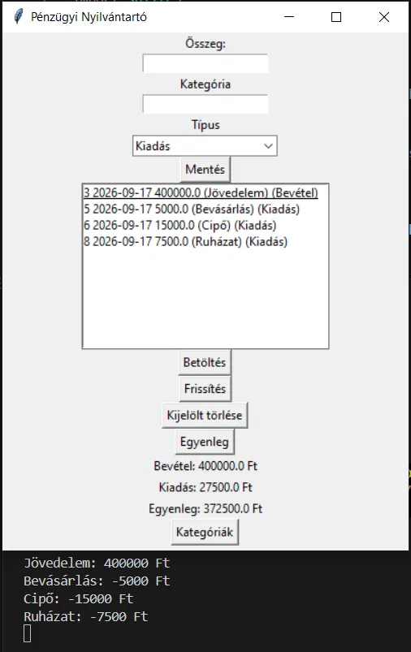

# Pénzügyi Nyilvántartó

Egy egyszerű asztali program a bevételeim és kiadásaim nyilvántartására. A Python-tanulásom gyakorló projektjeként készült, és fokozatosan fejlesztem.

## Funkciók

- **Bevétel és kiadás rögzítése** - összeg, kategória és típus (Bevétel / Kiadás) megadásával. A dátumot a program automatikusan beírja.
- **Betöltés** - a listában kijelölt tételt vissza lehet tölteni szerkesztésre.
- **Frissítés** - a betöltött tétel módosítás után elmenthető.
- **Kijelölt törlése** - egyesével lehet törölni a tételeket.
- **Egyenleg** - a program kiszámolja és kiírja a bevételek, a kiadások és az egyenleg összegét.
- **Kategóriák** - kategóriánkénti összesítés (egyelőre a konzolra írja ki).

## Használt technológiák

- Python 3
- Tkinter - a felülethez
- SQLite - ebben tárolom az adatokat (`penzugy.db`)
- SQLAlchemy - ezzel kezelem az adatbázist, így nem kell kézzel SQL-t írnom
- pytest - a tesztekhez

## Felépítés

A kódot három részre bontottam:

| Fájl | Mi van benne |
| --- | --- |
| `modellek.py` | a `Tranzakcio` és `Kategoria` táblák leírása, és az összeg ellenőrzése |
| `adatreteg.py` | az összes adatbázis-művelet (mentés, lekérdezés, törlés, összesítések) |
| `financial_tracker.py` | a felület és a program indítása |

Negatív összeget nem lehet elmenteni: ilyenkor a modell `ValueError`-t dob, a felület pedig kiírja a hibát a konzolra. A 0 Ft-os tételt szándékosan engedi a program, mert az is információ (pl. egy hónapban 0 Ft volt egy díj).

## Telepítés és futtatás

```
cd personal_finance_tracker
python -m venv .venv
.venv\Scripts\activate
pip install -r requirements.txt
python financial_tracker.py
```

## Tesztek

A tesztek ellenőrzik az összeg-ellenőrzést, a mentést, az összesítést és a törlést. Saját ideiglenes adatbázison futnak, a `penzugy.db`-hez nem nyúlnak.

```
pip install -r requirements-dev.txt
pytest -v
```

## Mit tanultam

- Az első változat egy fájlban volt, sima `sqlite3`-mal és kézzel írt SQL-el. Később átírtam SQLAlchemy-re, ami rövidebb és átláthatóbb kódot adott.
- Kiderült, hogy a kategóriák betöltésénél minden tételhez külön lekérdezés futott (N+1 probléma). Ezt `selectinload`-dal oldottam meg.
- Az adatbázis-műveleteket kiszerveztem egy külön fájlba. Így a felület nem tud az adatbázisról, és az adatréteget tesztelni is lehet.
- Megtanultam pytesttel teszteket írni, és azt, hogy a tesztek ne a valódi adatbázisba írjanak.
- Minden nagyobb változtatást külön Git-ágon csináltam, és csak a kész, kipróbált változatot fésültem össze a `main`-nel.

## Screenshot

